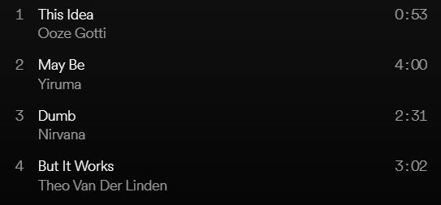

# Playlistify
[**playlistify.debkbanerji.com**](https://playlistify.debkbanerji.com)

Convert text to meme playlists from input text using a dynamic programming.

## Usage

The algorithm attempts to create a playlist who's track names form the input text when concatenated together. It's designed to parallelize API calls to optimize runtime.

Login with Spotify is required since Spotify is the data source. The app doesn't store any user information - login is only required so tracks can be searched for using the Spotify API, and if you want to save any created Playlists.

## Deployed Version
A deployed version can be found at [**playlistify.debkbanerji.com**](https://playlistify.debkbanerji.com)

**Important: Login will not work unless your Spotify email is whitelisted in the console**

If you're a friend of mine who wants to mess around with the app, let me know and I can enable it for your Spotify account.

You can also open an issue on the [issues tab](https://github.com/debkbanerji/playlistify/issues) if you just stumbled upon this.

If there's enough user demand, I can look into opening this up for general usage, but doing this for Spotify apps isn't as easy as it once was.
